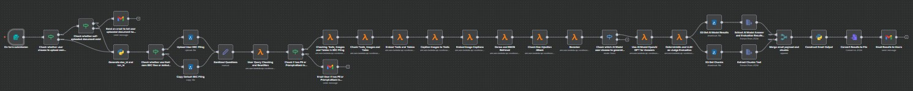
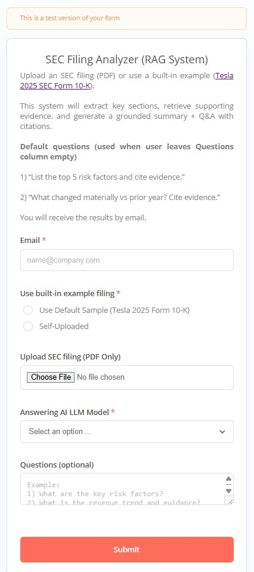
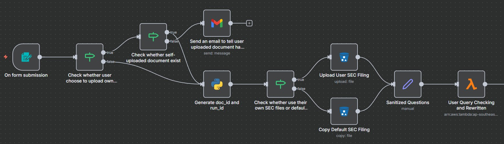
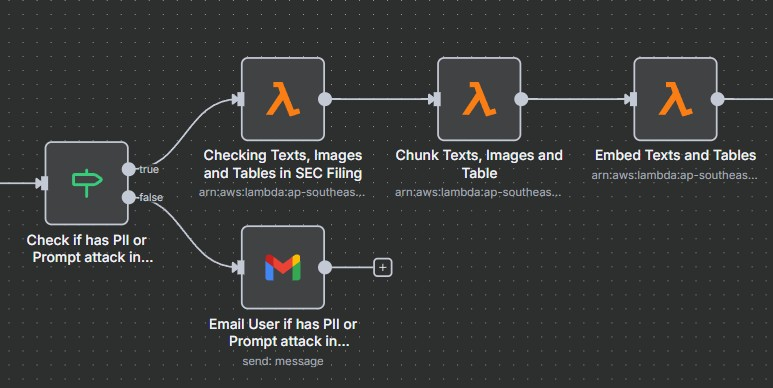
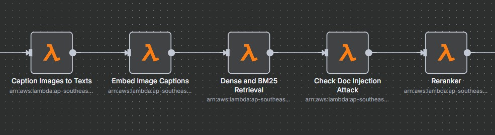
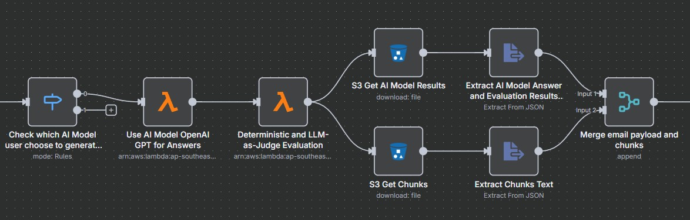
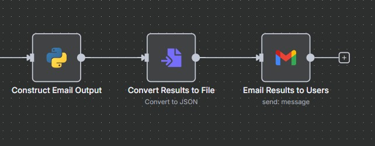

# SEC Filing Analyzer (RAG System)

## Full Workflow Overview

## Part 0 — User Intake (n8n Form): Document Upload + Questions + Required Email

**Live form URL:** https://n8n.srv1130258.hstgr.cloud/form/64a40c19-fbe8-4b97-a4c4-ab6c8bab91c0

The system starts with an **n8n Form Trigger**, which hosts a form page and starts the workflow when a user submits it.

### What the form collects (and why it matters)

#### 1) Email (Required)
Users **must provide an email address**. The workflow sends the final results (answers + citations + supporting evidence) to this address.

#### 2) Document source: Default sample vs self-uploaded PDF
Users can choose one of two options:

- **Use Default Sample (Tesla 2025 Form 10-K)**  
  If the user **does not upload any PDF**, the workflow automatically falls back to this built-in filing and runs the full pipeline on it.

- **Self-Uploaded (PDF only)**  
  If the user uploads a PDF, the workflow uses it as the source document for the run.

> This design guarantees the system is always runnable for reviewers/interviewers, even without a local PDF.

#### 3) Questions (Optional) with strong defaults
Users may enter one or multiple questions.  
If the user **leaves the Questions field empty**, the workflow runs these **default questions**:

1. **“List the top 5 risk factors and cite evidence.”**  
2. **“What changed materially vs prior year? Cite evidence.”**

These defaults are designed to demonstrate retrieval quality (finding the right sections) and grounding quality (returning answers with citations).

#### 4) Answering LLM selection
Users select the answering model from the dropdown (currently only support OpenAI (GPT-5.2)). The workflow applies this choice later when generating the final response and emailing results.

## Part 1 — Intake: form submission → doc selection → S3 write + question sanitization

**What happens here**
1. **Form submission triggers the workflow** (n8n Form Trigger).
2. Workflow checks whether the user selected:
   - **Self-uploaded** SEC filing, or
   - A **built-in default** filing (sample)
3. Generates **`doc_id`** and **`run_id`** (used to key all downstream artifacts).
4. Uploads/copies the chosen filing into S3 (source-of-truth storage).
5. Applies **question sanitization** (normalize format, split lines, remove empty entries).
6. Calls a **User Query Checking & Rewritten** Lambda (**RAG guardrails + retrieval-boosting** stage).

### Deep dive: **User Query Checking & Rewritten (AWS Lambda)**
This Lambda is where the workflow turns raw user input into **safe, retrieval-ready queries**:

- **PII screening & sanitization**  
  Detects and masks/redacts sensitive data in questions before any downstream processing.

- **Prompt injection detection (treat user input as untrusted)**  
  Flags malicious instructions (e.g., “ignore previous instructions”, “reveal secrets”) so the system can block or sanitize before retrieval/generation. OWASP recommends layered defenses because LLMs don’t naturally separate instructions from data.

- **Multi-query expansion to improve RAG recall**  
  Generates multiple query variants per question (keyword-style + semantic-style), then passes these downstream so BM25/dense retrieval can cover more phrasing and terminology. Haystack documents this as **MultiQuery retrieval / QueryExpander** to increase retrieval recall.

**Output of this Lambda (conceptually)**
- `sanitized_questions` (safe canonical questions)
- `expanded_queries` (multi-query variants for higher recall)
- `risk_flags` / `decision` (allow / sanitize / block)

## Part 2 — Parse & Index Prep: detect modalities → structure-aware chunking → embed + upsert to vector DB

**What happens here**
1. **Check whether the PDF contains text / images / tables (and which pages).**  
   This is a lightweight “content inventory” step so the pipeline knows what to process downstream .
2. **Chunk texts, images and tables** (structure-aware chunking).
3. **Embed texts and tables** and store them in the **Pinecone vector database** (dense vector index).

---

### Deep dive: **Chunk Texts, Images and Tables (Structure-aware chunking)**
This Lambda performs **structure-aware (layout/section-aware) chunking** instead of naive fixed-length splitting:

- Uses document structure cues (e.g., headings/sections/paragraph boundaries) to keep chunks **semantically coherent**.
- Produces stable `chunk_id` plus metadata like `page` / `section_path` so later stages can:
  - retrieve more precisely, and
  - generate **auditable citations** back to the source.
  
Structure-based chunking is widely recognized as improving RAG quality because higher-quality, coherent chunks lead to better retrieval relevance.

---

### Deep dive: **Embed Texts and Tables → Vector DB (Pinecone)**
This Lambda converts content into vectors and writes them to a vector database for semantic retrieval.

**Embedding model used:** `text-embedding-3-small`  
- This is **OpenAI’s embedding model** designed specifically for turning text into numerical vectors for similarity search and retrieval.  
- **Why choose it here:** it’s a strong default for RAG because it balances **quality and cost**, and is intended for large-scale embedding + retrieval workloads.

**Vector database:** Pinecone  
- Vectors (plus metadata like `doc_id`, `chunk_id`, `page`, `type=text/table`) are **upserted** into a Pinecone index/namespace so later stages can do dense retrieval and filtered search. 
- Pinecone supports **metadata filtering** at query time, which is useful for constraining retrieval to a given document/run.

**Output of this stage**
- Chunk artifacts in S3 (for traceability + citations)
- Vector DB populated with embeddings for:
  - text chunks
  - table-derived text chunks (so tables become retrievable evidence)
  
## Part 3 — Multimodal Retrieval & Ranking: image captions → caption embeddings → hybrid retrieval → doc-injection defense → RRF + cross-encoder rerank

This stage is the **core RAG “quality engine”**: it turns non-text evidence into searchable text, retrieves candidate evidence with **two complementary retrievers**, defends against **document injection**, then applies **fusion + reranking** to maximize citation quality.

---

### 3.1 Caption Images → Text (Salesforce/BLIP)
**Node:** *Caption Images to Texts*  
**Model:** `Salesforce/blip-image-captioning-base`

**Why this step exists (RAG reason):**  
SEC filings often contain figures, charts, or scanned pages where important evidence is visual. Captions convert images into **textual “visual facts”** so they become searchable and citable in the same pipeline as normal text chunks.

**Why BLIP (and why “base”):**
- **BLIP is a vision-language pretraining (VLP) framework** designed for both vision-language understanding and generation, including image captioning.
- The **base** variant is a strong practical choice for production-style pipelines because it’s lighter/faster than very large captioners while still generating useful, retrieval-friendly captions.

**Output:** image captions + metadata (page/figure reference), stored as retrievable text artifacts.

---

### 3.2 Embed Image Captions → Vector DB (OpenAI embeddings)
**Node:** *Embed Image Captions*  
**Embedding model:** `text-embedding-3-small`  
**Store:** Pinecone vector database

**Why this step exists (RAG reason):**  
Once images become text (captions), embedding them enables **semantic retrieval**: users can ask “What does the chart imply about revenue trend?” and still retrieve relevant visual evidence even if the exact words don’t appear verbatim.

**Output:** caption vectors upserted into Pinecone alongside chunk metadata (doc_id/run_id/page/type).

---

### 3.3 Dense + BM25 Retrieval (Hybrid Retrieval)
**Node:** *Dense and BM25 Retrieval*

**Why two retrieval types (and why it’s impressive):**
- **BM25 (sparse retrieval)** is great for exact terminology, acronyms, and finance-specific keywords (“impairment”, “going concern”, “MD&A”).  
- **Dense retrieval (vector search)** is great for semantic matches when wording differs (“liquidity pressure” vs “cash constraints”).  
- Hybrid search runs both in parallel and merges results to get the best of both worlds.

**Output:** two ranked candidate lists (BM25 list + dense list) for each expanded query.

---

### 3.4 Check Document Injection Attack (RAG security)
**Node:** *Check Doc Injection Attack*

**Why this check is needed:**  
RAG pipelines feed retrieved text into the LLM context. If the document (or injected content inside it) contains malicious instructions like “ignore the system prompt” or “exfiltrate secrets”, the model may follow them—this is a known class of **RAG poisoning / indirect prompt injection**.

OWASP explicitly calls out **RAG poisoning** as an attack pattern where malicious instructions are injected into documents or vector DB content to manipulate downstream responses.

**What this node does conceptually:**
- scans retrieved chunks/captions for instruction-like content
- flags or removes suspicious evidence before it reaches the answering model
- preserves an audit decision (allow/sanitize/block)

---

### 3.5 RRF Fusion + Cross-Encoder Reranker (Precision booster)
**Node:** *Reranker*  
**Fusion:** Reciprocal Rank Fusion (RRF)  
**Reranker model:** `cross-encoder/ms-marco-MiniLM-L6-v2`

#### Why RRF (fusion)
BM25 and dense retrieval output scores on different scales. **RRF fuses by rank**, not by raw score, so it’s robust and requires minimal tuning.

#### Why reranking (and why cross-encoders)
Dense/BM25 retrieval are optimized for **fast candidate generation**, not perfect ordering. Cross-encoders evaluate *(query, passage)* pairs jointly and typically provide **better precision** on a small top-K set, which is exactly what you want before sending context to the LLM.

#### Why `ms-marco-MiniLM-L6-v2`
- It’s trained for **MS MARCO passage ranking**, a standard IR benchmark for reranking.
- MiniLM L6 is a common “sweet spot” for production: strong relevance scoring while staying relatively lightweight compared to larger rerankers.

**Output:** final reranked top-K evidence chunks/captions (the set used for citation-grounded answering in later part).

## Part 4 — Answering + Evaluation: GPT-5.2 generation → deterministic checks → LLM-as-judge (RAGAS) → S3 results assembly

**What happens here**
1. **Select answering model** (currently only supports **OpenAI GPT-5.2**).
2. **Generate answers with citations** using the retrieved + reranked evidence from Part 3.
3. Run **Deterministic + LLM-as-judge evaluation** to validate groundedness and quality.
4. n8n fetches outputs from **S3** (model results + cited chunks), extracts relevant fields, and merges them into an email-friendly payload.

---

### Deep dive: **Use AI Model (OpenAI GPT-5.2) for Answers**
This node is the “generator” in the RAG loop: it takes the **top-K evidence** (post fusion + reranking) and produces a **grounded answer with citations**.

- **Model:** GPT-5.2 (OpenAI). 
- **Citation enforcement via system prompt:** the system prompt explicitly instructs the model to:
  - use **ONLY the provided context**,
  - attach **chunk_id citations in square brackets** to **every factual claim**,
  - and **never invent chunk_ids** (only cite from the allowed list).

This is a practical way to reduce hallucinations and make outputs auditable, because the model is forced to “show its work” by tying claims to retrieved evidence.

---

### Deep dive: **Deterministic + LLM-as-Judge Evaluation (RAGAS)**

#### A) Deterministic checks (lightweight, high-signal)
A fast validation layer to catch structural issues early.  
Example: **JSON format validation** (and required fields present) so downstream parsing/emailing is reliable.

#### B) LLM-as-judge + RAGAS (semantic quality evaluation)
Some RAG failure modes are semantic and can’t be reliably caught by rules (e.g., citations exist but don’t actually support the claim). This stage uses **RAGAS metrics** to quantify RAG quality over time, including:
- **Faithfulness**
- **Answer relevancy**
- **Context precision / recall**  
([RAGAS metrics](https://docs.ragas.io/en/v0.1.21/concepts/metrics/))

This gives a measurable feedback loop to improve retrieval/reranking/prompting across iterations and makes the system feel production-grade rather than a one-off workflow.

## Part 5 — Packaging & Delivery: build email payload → export results → email to user

**What happens here**
1. **Construct Email Output (n8n Code node — Python):** formats the final payload into a reviewer-friendly report (answers + citations + selected evidence chunks). n8n supports Python in the Code node for custom formatting logic.
2. **Convert Results to File:** serializes the report into a downloadable artifact (e.g., JSON) for easy sharing and archival.
3. **Email Results to Users:** sends the report as an email attachment to the address provided in Part 0.

> This stage focuses on delivery and UX: the RAG “intelligence” is already completed in Parts 1–4.

---

# Repository Contents

This repository includes:
- **AWS Lambda functions** for parsing, chunking, embeddings, retrieval, reranking, guardrails, generation, and evaluation
- **IAM policies** required to run each stage (least-privilege recommended)
- **Deployment scripts / instructions** for:
  - Lambda as **.zip packages**
  - Lambda as **container images via ECR**
  - Dockerized services on **Amazon ECS**
- **n8n Python Code node snippets** used for glue logic (run_id/doc_id generation, payload shaping, email formatting)

> Notes:
> - Lambda supports both **zip deployments** and **container image deployments** (stored in ECR).
> - ECS is used for long-running/container-native components. 

---

# Deployment Guide (High Level)

## A) Deploy Lambda via ZIP
- Build a deployment package and upload via console/CLI/S3.

## B) Deploy Lambda via Container Image (ECR)
- Build Docker image → push to ECR → create/update Lambda from container image.

## C) Deploy containers on ECS
- Build image → push to ECR → create ECS task definition → run as ECS service.

---

# Security & Safety Notes

This workflow includes:
- **PII detection + redaction** before downstream processing
- **Prompt injection screening** on user inputs
- **Document injection screening** on retrieved context before generation

These guardrails help keep RAG grounding reliable and prevent instruction hijacking.

---

# How to run (for reviewers)

1. Open the **n8n Form** and submit:
   - email
   - sample filing or upload your own PDF
   - optional questions
2. Wait for the email output containing:
   - answers
   - citations
   - evidence chunks

---

# License
This project is released under the **MIT License**. 